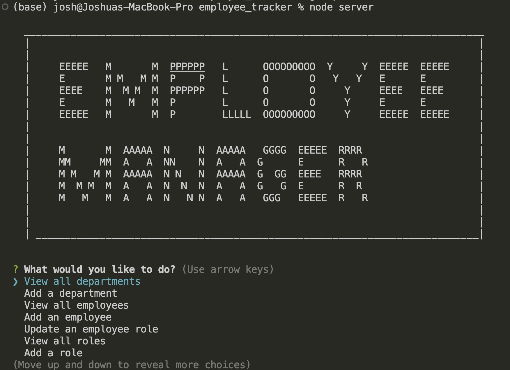

# Employee Tracker

 

## Description

This project is an employee tracker content management app for business owners to be able to manager their employees, roles, departments and managers in their database via the command line. The database I designed is using the MySQL database. My biggest challenge with this project was creating the functions that had to manipulate the data in the database, which for me was challenging, I struggled but in the end completed. Even though Ive completed the challenge Id still love to further my knowledge on the subject in the future.

## Table of Contents

- [Link](#link)
- [ScreenShot](#screenshot)
- [Installation](#installation)
- [Usage](#usage)
- [Credits](#credits)
- [License](#license)
- [Badges](#badges)
- [API](#api)

## Link

Below is a link to a walk through video demonstrating the app in use: 
[Employee_Tracker](https://drive.google.com/file/d/19NN1wV88RTxYi4U2FR6Hnq_ky4EVGg6K/view) 
[Projects_Repo](https://github.com/garciajv86/Employee-Tracker)

## ScreenShot

 

 

## Installation

This app requires the MySQL database to be installed on your computer, I provided a link below. 
[MySQL_Download](https://dev.mysql.com/downloads/mysql/)

## Usage

To use this app you must navagate to the directory the server.js is in then open the terminal, once in the terminal you must run the command "node server.js" and the app will then start up and present you with a question and a list of options to choose from. Its a simple command line app that will walk you through with a list of questions that pertain to the option that you choose, and if you want to exit then on the options menu there is an exit option you can choose to exit the application.

## Credits

- Joshua V. Garcia

- [My GitHub Profile](https://github.com/garciajv86)

## License

 
This project is protected under the [MIT](https://choosealicense.com/licenses/mit/) License.

## Badges

 

 

 

## API

MySQL2 and Inquirer 8.2.4 was the NPM packages used for this project

- [MySQL Docs](https://www.npmjs.com/package/mysql2#installation)
- [Inquirer Docs](https://www.npmjs.com/package/inquirer)
